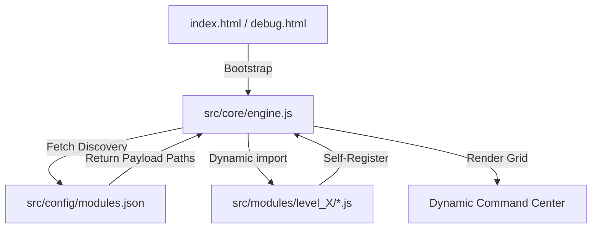
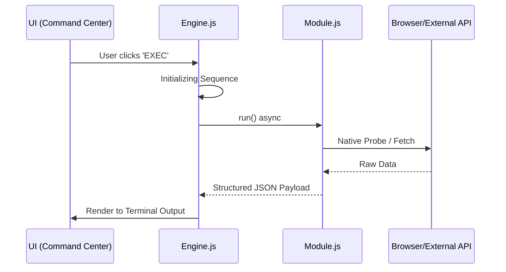

<div align="center">

# 🛠️ DeAnonymizer
### *Professional Intelligence & Vulnerability Diagnostic Framework*

[](https://opensource.org/licenses/MIT)
[](#)
[](#)
[-9d00ff.svg?style=flat-square)](https://github.com/AhmadHassan-BTed)
[](https://AhmadHassan-BTed.github.io/Pinpoint-Location-Tracker/)

**Engineered by Ahmad Hassan (B-Ted)**

---
*A high-fidelity cybersecurity laboratory designed for diagnostic telemetry, advanced fingerprinting, and browser security boundary research.*
</div>

## 🏗️ Architecture Overview

The toolkit is built on a **Zero-Coupling Dynamic Plugin Architecture**. The core engine remains entirely agnostic of individual module logic, discovering and loading tools at runtime via a centralized manifest.



### Key Design Principles:
- **0% Coupling**: Core engine logic and security payloads never touch.
- **100% Cohesion**: Each module is a self-contained unit with its own metadata and execution logic.
- **Dynamic Handshake**: New tools are added by updating a JSON manifest—no code modification required.

---

## 🚦 Threat Escalation Hierarchy

Tools are categorized into four distinct levels, reflecting the severity of information exposure.

| Level | Classification | Visual | Focus Area |
| :--- | :--- | :--- | :--- |
| **L1** | **Standard Recon** | 🟢 Green | OS, Browser, and Performance Telemetry |
| **L2** | **Advanced Profiling** | 🟡 Yellow | Network Topology & Hardware Fingerprinting |
| **L3** | **Critical Intelligence** | 🔴 Red | PII, Credentials, and Social Identity |
| **L4** | **High-Fidelity Exploits** | 🟣 Purple | Security Bypasses & Hardware Silicion Tracing |

---

## 🧪 System Workflow & Data Flow

When a module is executed, it follows a strict lifecycle from initialization to exfiltration.



---

## 📁 Repository Structure

```text
Pinpoint-Location-Tracker/
├── src/
│   ├── core/
│   │   ├── engine.js         # Framework Orchestrator
│   │   └── transmitter.js    # Data Exfiltration Logic
│   ├── config/
│   │   └── modules.json      # Discovery Manifest
│   ├── modules/              # Plug-and-Play Tools
│   │   ├── level1/           # Standard Recon
│   │   ├── level2/           # Fingerprinting
│   │   ├── level3/           # Intelligence
│   │   └── level4/           # Bypass Lab
│   └── styles/               # Global Design System
├── debug.html                # Automated Lab Shell
└── index.html                # Stealth Dashboard
```

---

## 🛠️ Internal Module Structure

Every module must adhere to a strict interface to ensure 100% cohesion within the framework.

<details>
<summary><b>View Module Template (JavaScript)</b></summary>

```javascript
/**
 * Pinpoint Module Template
 */
export default {
    id: 'unique_identifier',
    title: 'Display_Name',
    level: 4, // Level 1-4
    info: "Description of the security exposure.",
    steps: [
        "Phase 1 Recon...",
        "Phase 2 Probe...",
        "Phase 3 Exfiltration..."
    ],
    run: async () => {
        // Implementation logic
        return { data: 'captured_intel' };
    }
};
```
</details>

---

## 🚀 Development & Contribution

The repository is maintained with a focus on engineering excellence. Contributors are encouraged to expand the toolkit by implementing new diagnostic modules.

1.  **Draft**: Implement the module using the standard template.
2.  **Locate**: Place the script in the corresponding `src/modules/levelX/` folder.
3.  **Register**: Add the file path to `src/config/modules.json`.
4.  **Verify**: Open `debug.html` to confirm the tool is automatically rendered and functional.

---

<div align="center">
  <br />
  <sub><b>Developed & Documented by Ahmad Hassan (B-Ted)</b></sub>
  <br />
  <sup>Professionally maintained for Cybersecurity Research & Education</sup>
</div>
